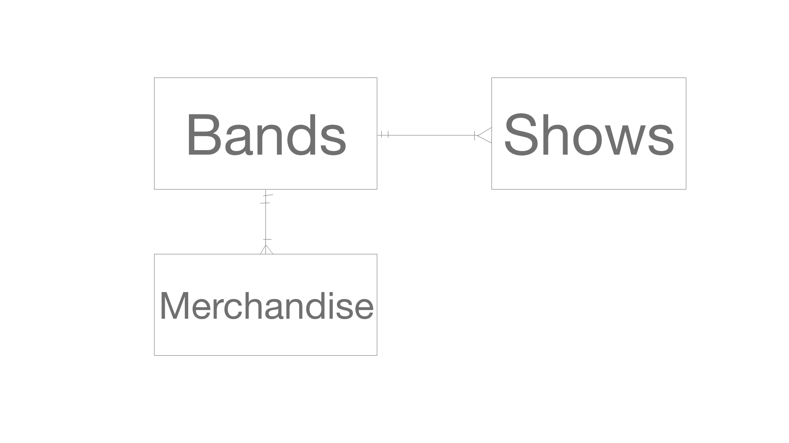
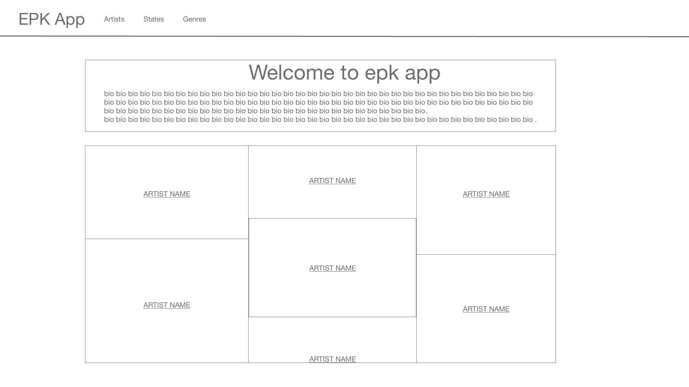
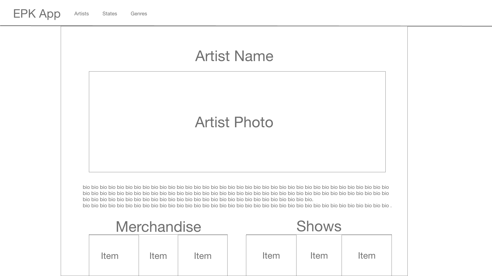
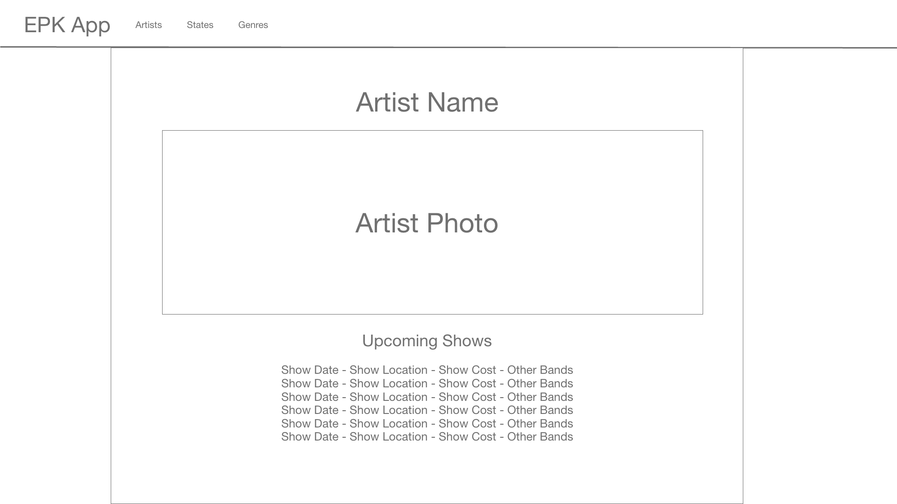
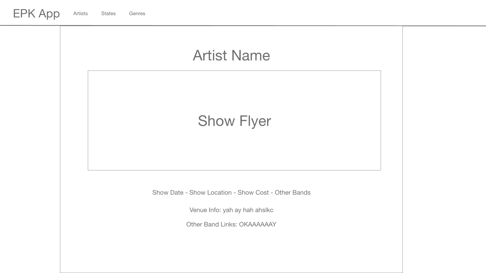
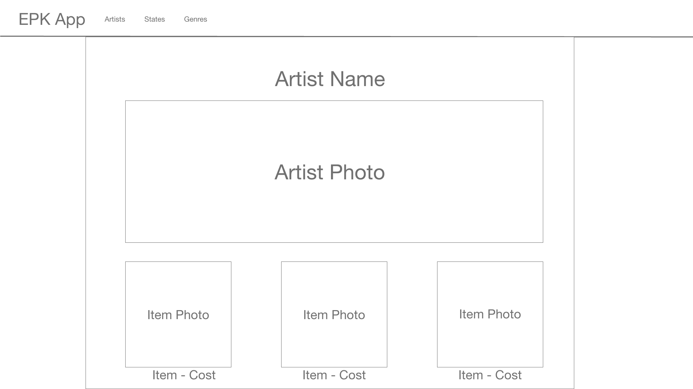
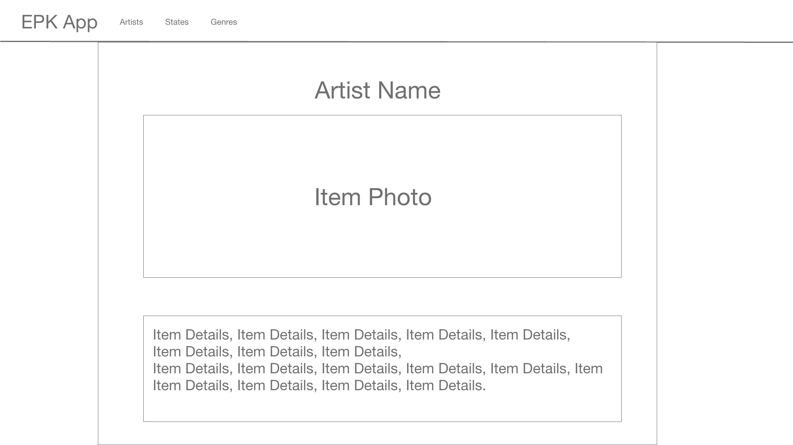

# sei22-Project4
## indiEPK

indiEPK is a resource for artists and fans to keep up with and discover artists around the world without having to fight through the flood of social media. Historically, press kits have been a tool for an artist to showcase anything relevent that they may be working on or have recently done. With the rise in internet popularity, the music business turned to electronic press kits, or EPK's. Now with the rise of social media, EPK's have fallen to the wayside. While social media is a great tool for artist to fan interaction, we've lost the plot in a sense, which is artists doing what artists do: create.

At indiEPK, we want to find that missing link and offer up a way for artists to present themselves in a clean and effective manner without the fuzz of social currency. Whether you're a listener just looking to see which artists in your city you should be keeping an eye on, or you're another artist planning a tour and looking for networking opportunities. We want to provide the most simple platform for music business without the hassle of the music business.

* [Deployed App](https://indiepk.herokuapp.com/)
* [Project Board](https://trello.com/b/jPOu4Dbw/sei22-project-4)

## Technologies Used:
* React
* Python
* Django
* Material UI
* CSS

## V2 Goals:
* Sort and be able to search artists by Location/Genre
* Alphabetically sort results (artists)
* Have a "featured list" where top artists can somehow be ranked and displayed first
* Set up some kind of player whether it's spotify embeded links or something else.
* Implement some kind of image/file upload system

## ERD

## Wireframes

